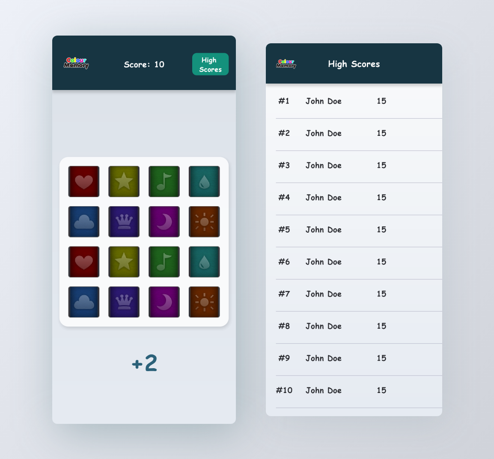

# MemoryGame

Colour Memory is an Android app consisting of a board which displays eight pairs of cards where each pair is of different colour. 
A player has to touch the cards to view the colours and match all the pairs. 

If the player matches the pair correctly, then:
1. he scores 2 points and the matched pair of cards is removed from the board
2. otherwise, he loses 1 point and the card is flipped to face down.

The player can also view his scores and rankings against other players.

# Project Setup
The remote repository of the app is available on the GitHub.
Clone the repo, open the project in Android Studio, and Run.
`https://github.com/adilkdev/MemoryGame.git`

# Architecture
Colour Memory app follows MVVM architecture to provide a clear flow of data and separation of components.

The app uses only local data and there’s no dependency on the internet. For persistent data storage the app uses Room Database for Android.

In MVVM the activity acts as View. All the view components are present in the activity. The state and data of the app is maintained in the view model. 
Also, all the logics reside in the view model.

In the activity, for observing the data residing in the view model, we are using live data, which enables to sync the user interface with the data
available in the view model instantly.

The app uses multithreading with Kotlin Coroutines, to take any possible load away from the UI thread to ensure smooth and
fluid user experience.

The app uses dependency injection so that the classes don’t
have to generate hard dependencies and also it helps to avoid
boilerplate.

# Dependencies

• Default Android :   
`implementation "org.jetbrains.kotlin:kotlin-stdlib: 1.5.10"`  
`implementation "androidx.core:core-ktx:1.5.0"`  
`implementation "androidx.appcompat:appcompat:1.3.0"`  
`implementation "com.google.android.material:material:1.3.0"`  
`implementation "androidx.constraintlayout:constraintlayout:2.0.4"`    

• Room Database  
`// Persistent data storage`  
`implementation("androidx.room:room-runtime: 2.3.0")`  
`kapt("androidx.room:room-compiler: 2.3.0")`  
`implementation("androidx.room:room-ktx: 2.3.0")`  

• Dagger-Hilt  
`Dependency injection`  
`implementation("com.google.dagger:hilt-android:2.35")`  
`kapt("com.google.dagger:hilt-android-compiler: 2.35")`  

• Lottie  
`// Animated content`  
` implementation "com.airbnb.android:lottie: 3.7.0"`  

• Truth  
`// Fluent assertions`  
`testImplementation "com.google.truth:truth:1.1.3"`  

• Unit Tests  
`testImplementation "junit:junit:4.13.2"`  

• Instrumented Tests  
`androidTestImplementation "org.jetbrains.kotlinx:kotlinxcoroutines-test:1.5.0"`  
`androidTestImplementation "com.google.truth:truth:1.1.3"`  
`androidTestImplementation "androidx.arch.core:core-testing:2.1.0"`  

`// Espresso`  
`def androidx_test_espresso = "3.3.0"`  
`androidTestImplementation "androidx.test.espresso:espressocore:$androidx_test_espresso"`  
`androidTestImplementation "androidx.test.espresso:espresso-contrib:$androidx_test_espresso"`  

`// androidx.test`  
`def androidx_test = "1.1.2"`  
`androidTestImplementation "androidx.test:runner:$androidx_test"`  
`androidTestImplementation "androidx.test:core:$androidx_test"`  
`androidTestImplementation "androidx.test.ext:junitktx:$androidx_test"`  

• RecyclerView  
`implementation("androidx.recyclerview:recyclerview:1.2.0")`  
 
# Unit Test 
The test class is present in the project which tests the methods of game activity’s view model.  
Unit test resides in this directory:  
`app/src/test/java/adil/app/memorygame/ui/game_screen/GameViewModelTest`  
[Go To Unit Test](https://github.com/adilkdev/MemoryGame/blob/master/app/src/test/java/adil/app/memorygame/ui/game_screen/GameViewModelTest.kt)

# Instrumentation Test
Instrumentation tests run on a device or an emulator and they can take advantage of the Android framework APIs.  
Instrumented test resides in this directory:  
`app/src/androidTest/java/adil/app/memorygame/data/local/db/dao/PlayerDaoTest`  
[Go To Instrumentation Test](https://github.com/adilkdev/MemoryGame/blob/master/app/src/androidTest/java/adil/app/memorygame/data/local/db/dao/PlayerDaoTest.kt)

# UI Test
Testing user interactions within a single app helps to ensure that users do not encounter unexpected results or have a poor
experience when interacting with your app. Espresso is used for UI Testing.  
UI test resides in this directory:  
`app/src/androidTest/java/adil/app/memorygame/ui/game_screen/GameActivityTest`  
[Go To UI Test](https://github.com/adilkdev/MemoryGame/blob/master/app/src/androidTest/java/adil/app/memorygame/ui/game_screen/GameActivityTest.kt)
